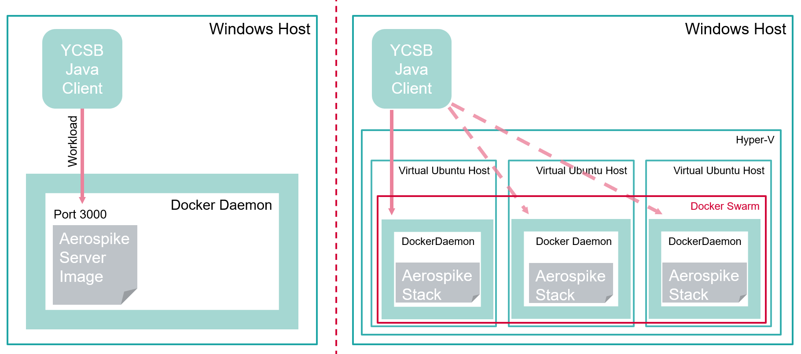

# README #

The objective of the workshop is to analyze, present, and demonstrate NoSQL systems and their concepts and to benchmark it using the Yahoo! Cloud Serving Benchmark (YCSB).

## Prerequisites ##

- Linux Host (preferably Ubuntu 20.04 LTS)
- Docker CE Engine (v...)
- Python 3.6+ & Python 2.7+ for YCSB (available in /usr/env/python <-- use a symlink)
- Multipass

## How it works



### Single Node Setup ###

1. Run the script `./run-benchmark.sh` from a terminal with bash to start the benchmark (starts docker image with specified config and workloads automatically). You can change the config used, workloads and record count at the top of the bash file if you'd like.
2. Execute the plot script `python3 plot-benchmark.py` to create the workload plots.
3. Done.

We can start the docker images and start a shell to inspect the container more closely if neccessary.

1. Run the Aerospike Server Docker Image with  
   `docker run -d -v "$(pwd)/confs/:/opt/aerospike/etc/" --name aerospike -p 3000-3002:3000-3002 aerospike/aerospike-server --config-file /opt/aerospike/etc/aerospike-mem_4G-rf_1.conf`.  
   Change the *--config-file* parameter according to your needs.
2. Run `docker exec -it aerospike /bin/bash`.
3. Or export and verify the current config with `docker exec -it aerospike asinfo -v "namespace/test" >namespace-test.conf`.

### Multi Node Docker Swarm Cluster ###

**This did not work during testing!!!**

1. Start 3 virtual docker hosts with multipass:
   ```bash
   multipass launch --name=as-swarm-leader --cpus=2 --disk=5G --mem=2G --cloud-init=cloud-init.yaml lts
   multipass launch --name=as-swarm-node1 --cpus=1 --disk=5G --mem=2G --cloud-init=cloud-init.yaml lts
   multipass launch --name=as-swarm-node2 --cpus=1 --disk=5G --mem=2G --cloud-init=cloud-init.yaml lts
   ```

2. Create Docker Swarm:
   ```bash
   multipass exec swarm-leader docker swarm init
   SWARM_REGISTER_CMD=<copy from output>
   multipass exec swarm-node1 -- "$SWARM_REGISTER_CMD"
   multipass exec swarm-node2 -- "$SWARM_REGISTER_CMD"
   multipass shell swarm-leader
   docker nodes ls
   git clone https://github.com/tairun/aerospike-docker-swarm.git
   cd aerospike-docker-swarm
   nano aerospike.conf # Edit access-address in network section
   # Deploy the stack
   docker stack deploy -c aerospike.yml aerospike
   # Verify the stack
   # docker service logs aerospike_aeropsikedb
   docker stack ls
   docker service ls
   # Scale the cluster
   docker service scale aerospike_aerospikedb=3
   ```

## Sources ##

- https://github.com/aerospike/aerospike-docker-swarm#aerospike-docker-swarm
- https://stackoverflow.com/questions/24418815/how-do-i-install-docker-using-cloud-init
- https://gist.github.com/syntaqx/9dd3ff11fb3d48b032c84f3e31af9163
- https://gist.github.com/HighwayofLife/076d3f026642fb14dbaad9f5847bc0ce
- https://discourse.ubuntu.com/t/advantages-of-using-multipass-instead-of-docker-desktop-on-macos/18069
- https://multipass.run/docs/launch-command
